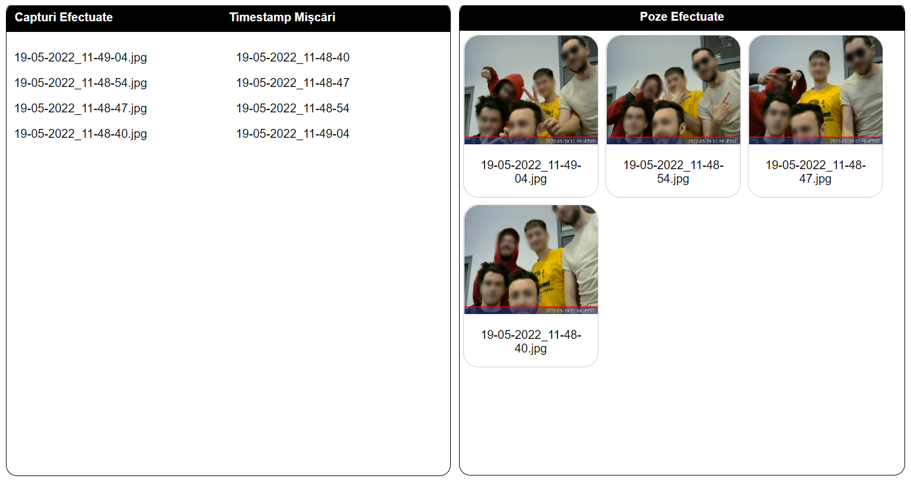
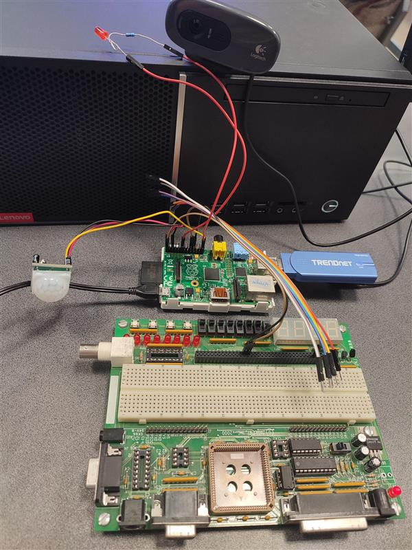

# 🛡️ Security System

Within this project I built a simple PI security system that takes photos upon detecting any movement through a motion/proximity sensor and a web camera. The photos are triggered only if a switch is turned on, and when the photo is taken an LED lights up. The pictures are stored in the board's internal memory, following a socket to send the data in a web interface provided by the Flask server.

| Web interface |
| :-: |
|  |

## ✨ Features

- Enable/disable through a switch
- Detects movement through a sensor that triggers the camera to take a picture
- Internal media storage
- Sends the data to a web interface
  - Shows the detection timestamps
  - Shows the taken pictures

## 🔮 Technologies

- Python as the backend language
- Flask for the server that runs on Raspberry PI
- JavaScript for the web interface

## 💾 Hardware used

- Raspberry Pi I
- FPGA board
- HC-SR501 motion sensor
- Logitech C270 web camera
- LED
- Cords
- TRENDnet 108Mbps network flash drive

## 👀 Preview

| The system |
| :-: |
|  |
